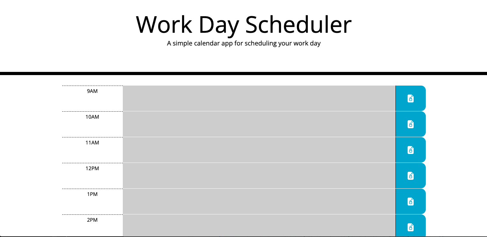

# work-day-scheduler
Coding Bootcamp Weekly Challenge 5. This is a daily planner tool. It is developed Using HTML, CSS and JavaScript. I also used third party APIs such as JQuery and Moment.js.

## About This Repository
This repository contains the working files for the Coding Bootcamp Weekly Challenge 5.  
The objective of this exercise is to feature dynamically updated HTML and CSS powered by JavaScript code, using two third party APIs: JQuery and Moment.js. The website basic structure was written in HTML. Javascript is used to created the list of tasks and evaluate each task against the current time of the day. The tasks are saved to local storage when the user clicks the lock button.

## Website
https://leandromichelena.github.io/work-day-scheduler/

## Page Screenshot

## Built With
* HTML
* CSS
* javascript
* jquery
* moment.js

## Support
If you find any bugs or have any questions, please contact me on Github.

## Authors and Acknowledgment
HTML, CSS, and javascript created by Leandro Michelena.  
Base code provided by Trilogy Education Services, a 2U, Inc. brand.

## License
MIT License
